# 
Javaweb

 

## javaweb-exp-01
 

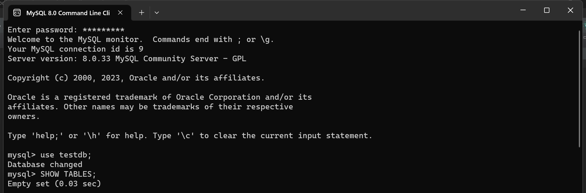

安装部署了 MySQL JDBC 驱动，将mysql-connector-j-8.0.33.jar放入了apache-tomcat-8.5.88\lib与pdh-java-web\src\main\webapp\WEB-INF\lib中配置好了数据库环境,并且学会操作 MySQL 数据库
 

写好了conn.java,Hserv.java以及register.html并且配置好了servlet-api.jar等Tomcat的环境，成功运行注册网页
 

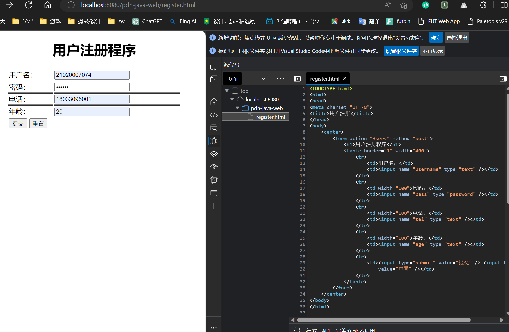

然后遇到各种问题，如发现一些库不支持Tomcat10.1于是改用8.5导致无法启动，

最后将Hserv.java中	@WebServlet("/Hserv")改为@WebServlet(urlPatterns = "/j2ee/Hserv")解决，成功重新启动网页
 

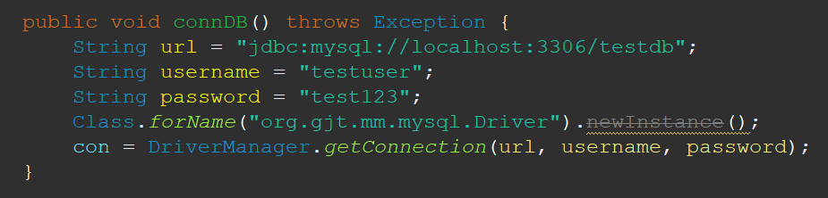
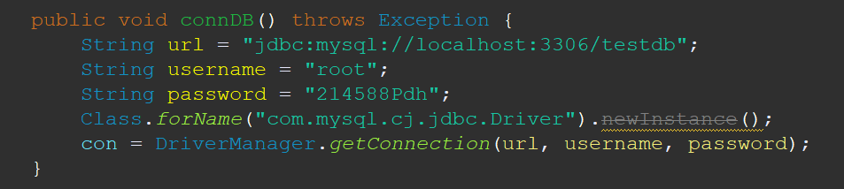
点击注册完毕后报错500排查后发现conn未修改，一开始只修改了username和password还是一直报错con对象为空，

最终发现org.gjt.mm.mysql.Driver是MySQL 5之前版本的旧驱动程序类名。

自MySQL 8.0版本开始，官方的MySQL驱动程序类名已更改为com.mysql.cj.jdbc.Driver。

 

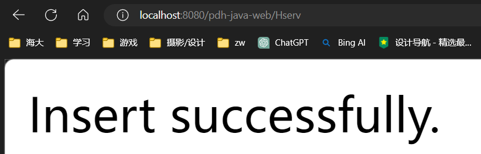

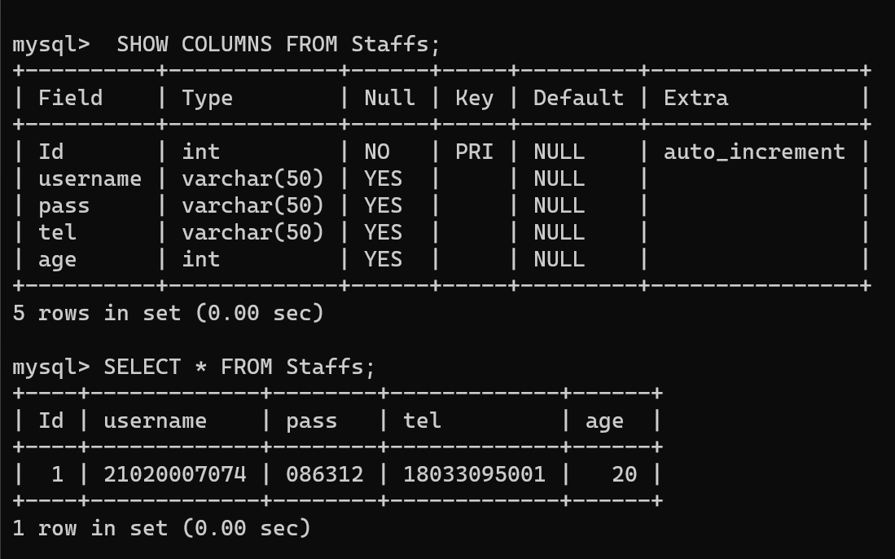
最终修改完毕后注册成功，数据库中拥有用户数据
 
 

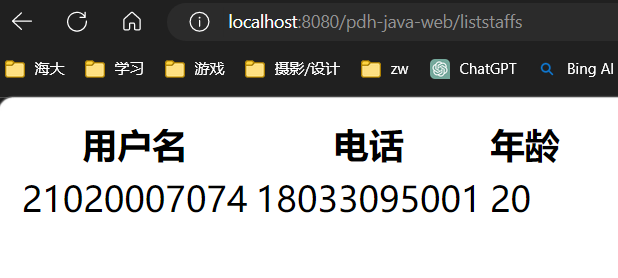

在页面中显示出当前已经注册的用户的列表，包括用户名、电话和年龄

 
 

## javaweb-exp-02
 

登录页面 login.html

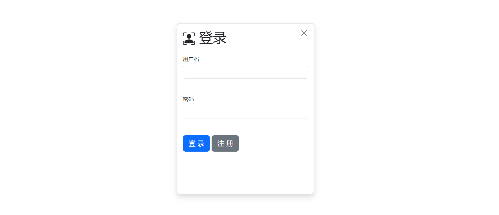

显示用户登录表单，提交到登录处理 Servlet。

登录处理 Servlet LoginServlet.java

			// 建立数据库连接
			Connection connection = DriverManager.getConnection(url, dbUsername, dbPassword);

			// 创建SQL查询语句
			String sql = "SELECT * FROM Staffs WHERE username = ? AND pass = ?";

			// 创建PreparedStatement对象，并设置参数
			PreparedStatement statement = connection.prepareStatement(sql);
			statement.setString(1, username);
			statement.setString(2, password);

			// 执行查询
			ResultSet resultSet = statement.executeQuery();

			if (resultSet.next()) {
				msg = "登录成功";
				UserModel userModel = new UserModel();
				userModel.setUsername(username);
				userModel.setPassword(password);
				userModel.setTelephone(resultSet.getString("tel")); // 根据实际数据库字段名称进行调整
				userModel.setAge(resultSet.getString("age")); // 根据实际数据库字段名称进行调整
				userModel.setRegistrationTime(resultSet.getString("registration_time"));
				userModel.setRole("user");

				// 获取当前会话
				HttpSession session = request.getSession(true);

				// 将用户名存储在会话中
				session.setAttribute("username", username);

		        // 获取ServletContext对象
		        ServletContext context = request.getServletContext();

		        // 获取在线用户数量
		        Integer onlineUserCount = (Integer) context.getAttribute("onlineUserCount");

		        // 如果在线用户数量为null，则初始化为0
		        if (onlineUserCount == null) {
		            onlineUserCount = 0;
		        }

		        // 递增在线用户数量
		        onlineUserCount++;

		        // 将递增后的在线用户数量存储到ServletContext中
		        context.setAttribute("onlineUserCount", onlineUserCount);
				
				request.setAttribute("LOGIN_MESSAGE", "success"); // 登录成功
				request.getSession().setAttribute("USER_INFO", userModel);
				response.setHeader("Refresh", "1; URL=welcome.jsp");
			} else {
				msg = "登录失败";
				request.setAttribute("LOGIN_MESSAGE", "error"); // 登录失败
				String errorMessage = URLEncoder.encode("用户名或密码错误", "UTF-8");
				response.sendRedirect("login.html?username=" + URLEncoder.encode(username, "UTF-8") + "&errorMessage=" + errorMessage);
			}

取得登录表单输入的用户名和密码，连接数据库，操作用户表，根据用户名和密码验证所
登录用户是否合法。如果合法，保存登录账号，累计在线人数，增加在线用户列表，转发到

主页 JSP。

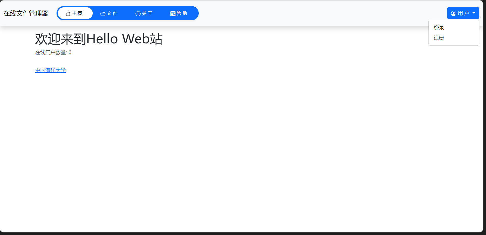

主页 JSP 页面 index.jsp

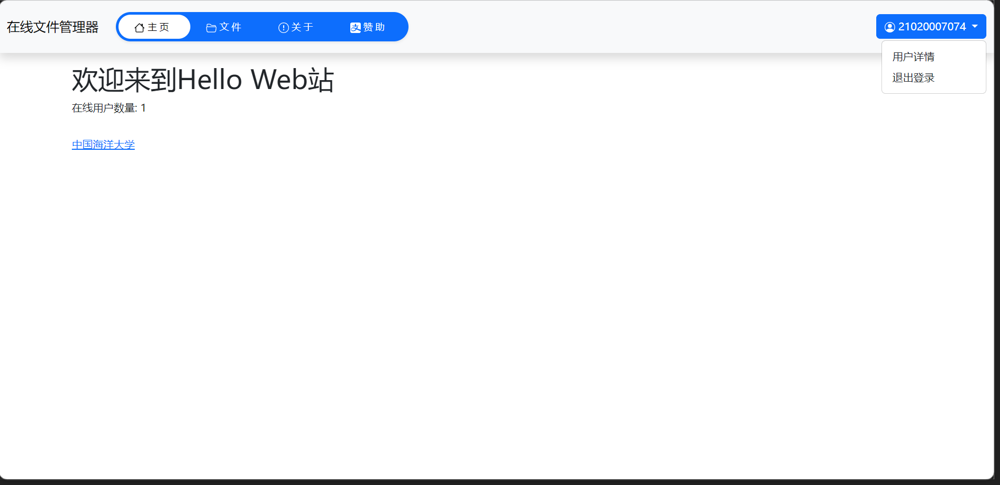

在主页的顶部导航栏合适的位置显示登录的用户账号，点击用户账号
显示 2 个链接，一个是用户详情链接，一个是用户注销链接；点击用户详情链接进入

用户详情页面；
• 在主页上显示系统在线人数和在线用户列表；
• 点击用户账号可以显示注销链接。如果单击注销，则请求用户注销处理 Servlet；

用户详情页面 userDetail.html
用户详情页面需要显示用户名、注册时间(之前注册时数据库忘了存注册时间，最近才加上重新注册了)等信息，需要显示用户的头像。(目前未输入图片url)

用户详情 Servlet UserDetailServlet.java

	// 查询用户信息
        PreparedStatement statement = null;
        ResultSet resultSet = null;
        UserModel user = null;
        try {
        	String sql = "SELECT * FROM Staffs WHERE username = ?";
        	statement = connection.prepareStatement(sql);
        	statement.setString(1, username);

            resultSet = statement.executeQuery();
            if (resultSet.next()) {
                user = new UserModel();
                user.setUsername(resultSet.getString("username"));
                user.setRegistrationTime(resultSet.getString("registration_time"));
                user.setTelephone(resultSet.getString("tel"));
                user.setAge(resultSet.getString("age"));
                //user.setAvatarUrl(resultSet.getString("avatar_url"));
            }

为用户详情页面提供数据。

注销处理 Servlet LogoutServlet.java

	 		HttpSession session = request.getSession(false);
	        if (session != null) {
	            String username = (String) session.getAttribute("username");
            
            ServletContext context = request.getServletContext();
            int onlineUserCount = (int) context.getAttribute("onlineUserCount");
            onlineUserCount--;
            
            context.setAttribute("onlineUserCount", onlineUserCount);
            
            session.removeAttribute("username");
        }
        
		request.getSession().invalidate();
		response.getWriter().append("User logout.");
		response.sendRedirect("index.jsp");

取得并销毁会话对象，减少在线人数，从在线用户列表中删除当前注销的用户 ID，重定向
到登录页面。

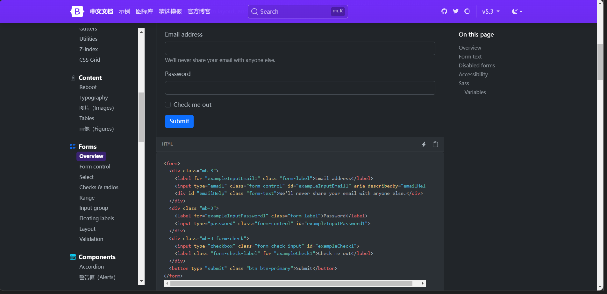

前端界面需要使用 Bootstrap 前端库进行适当的美化。

 
 

## javaweb-exp-03
 

在web.xml中设置过滤器拦截的页面（暂时设了几个），主要是index.jsp(visitorindex.html是用于给游客访问的主页)

	@WebFilter(urlPatterns = { "/upload.html", "/filelist.jsp", "/index.jsp" })
	public class UserIdFilter implements Filter {

	<!-- 过滤器映射 -->
	<filter-mapping>
		<filter-name>UserIdFilter</filter-name>
		<url-pattern>/index.jsp</url-pattern>
		<url-pattern>/upload.html</url-pattern>
		<url-pattern>/filelist.jsp</url-pattern>
	</filter-mapping>
	
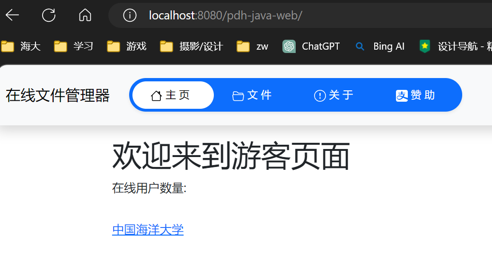	

这样访问网站时，首先进入游客主页visitorindex.html若在这个主页点击“文件”这类需要登录才能使用的网页，就会跳转index.jsp
从而被拦截至login.html

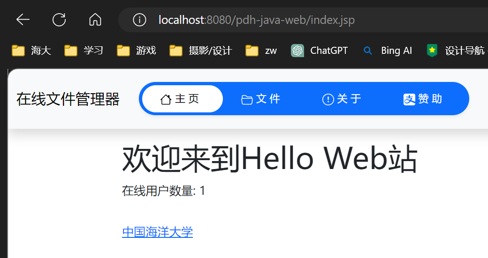	

登陆之后会转到index.jsp正常使用“文件”等内容

 
 

## javaweb-exp-04
 

	

面包屑导航栏点击后格式正确，可以跳转到正确的文件路径

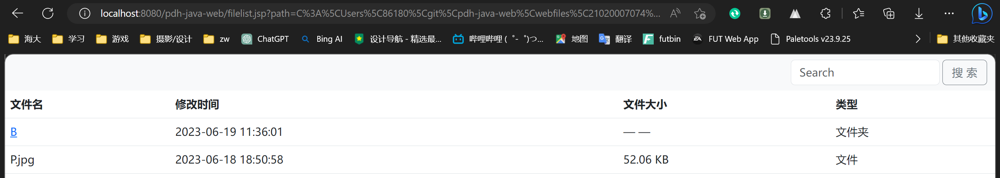	

若直接点击文件夹则导航栏消失，发现URL中原本的“2F”变为了“5C”斜杠使用错误

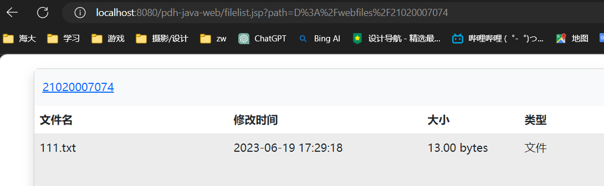	

面包屑导航栏从用户名开始

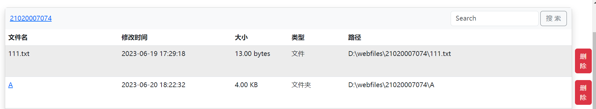

一开始想的是去url里path=之后获取文件路径来进行一些删除操作，后来发现直接file.getAbsolutePath()就可以获取路径

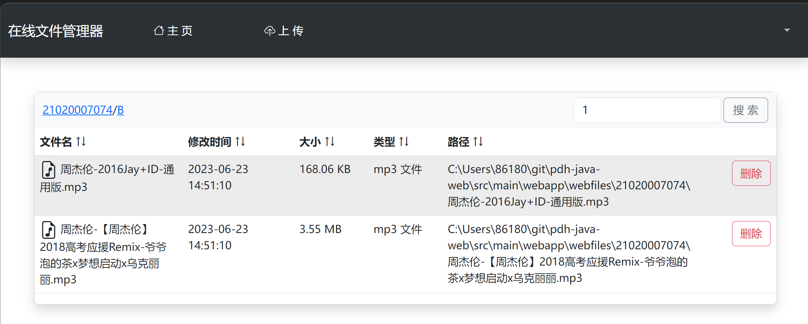

搜索框只能搜索根目录文件夹下的文件，多个小时的调试后无法解决被迫放弃搜索功能

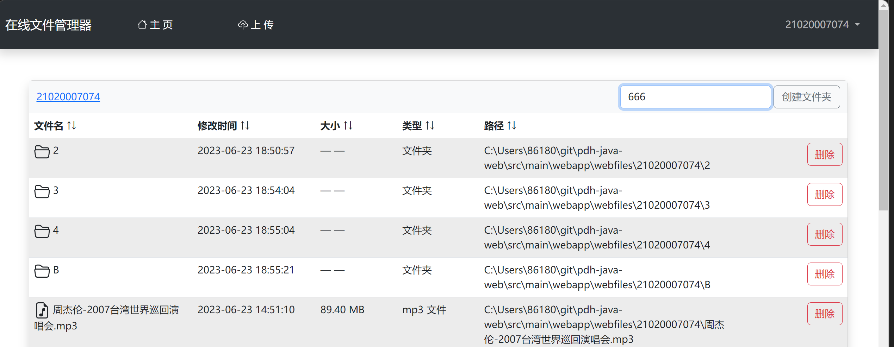
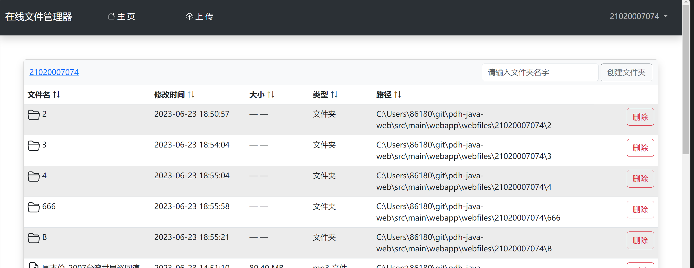

实现创建子目录

### 网页界面UI展示：
 

#### 游客主页

#### 注册页面

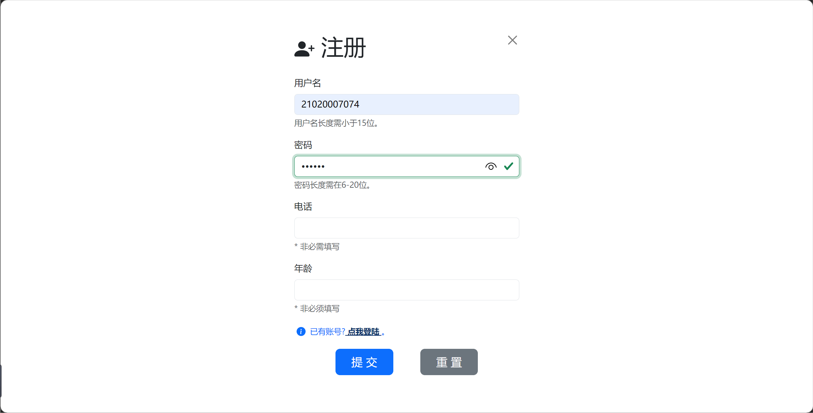

#### 登录页面

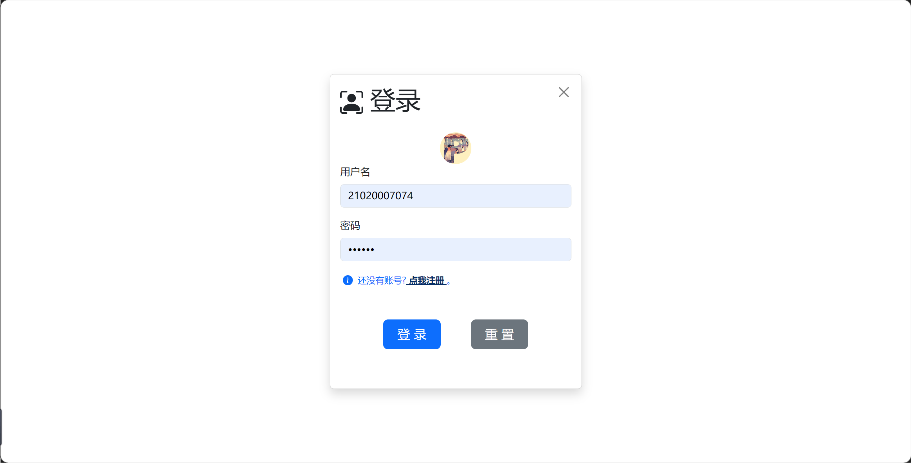

#### 欢迎页面

#### 用户主页

#### 用户详情

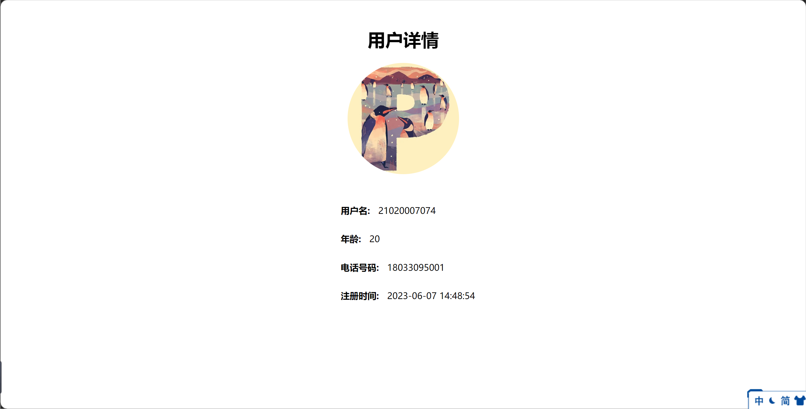

#### 文件主页

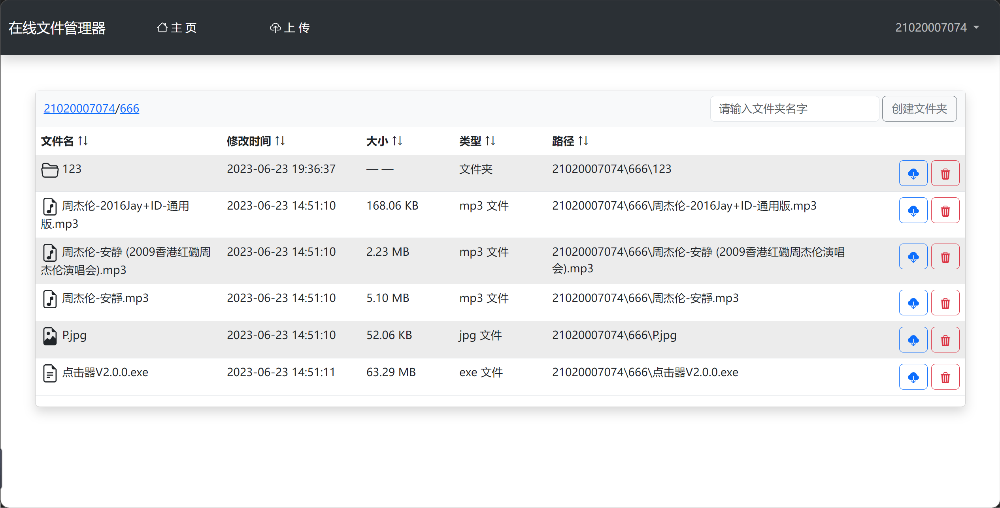

#### 删除与，上传，创建子目录

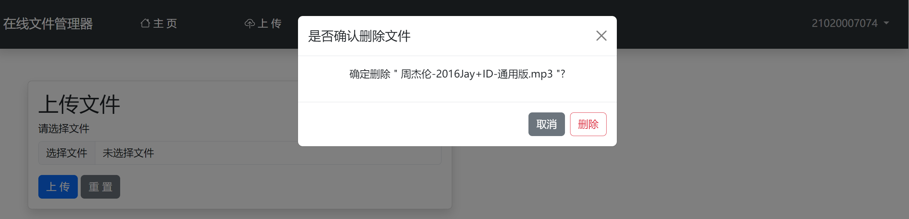

#### 文本编辑和上传

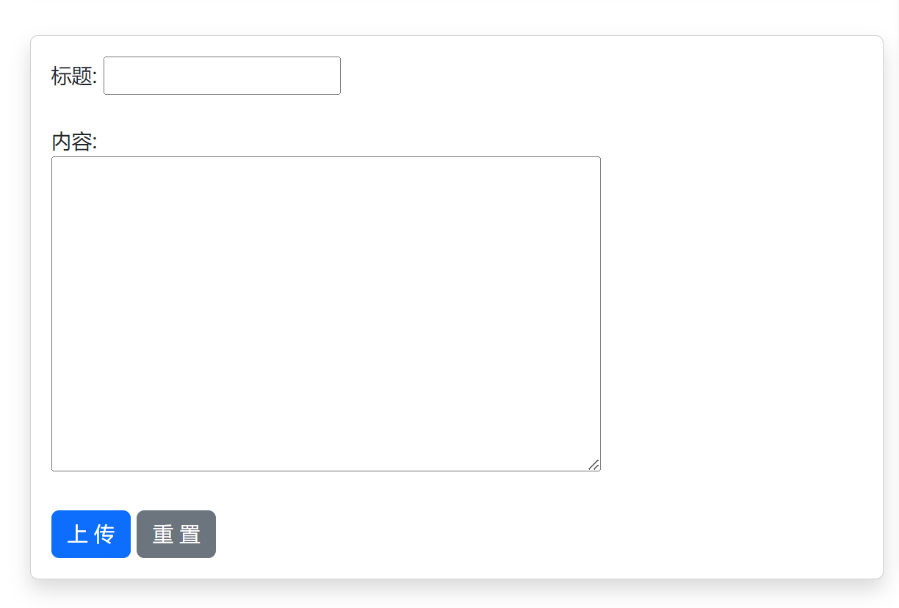

#### 查看文本内容

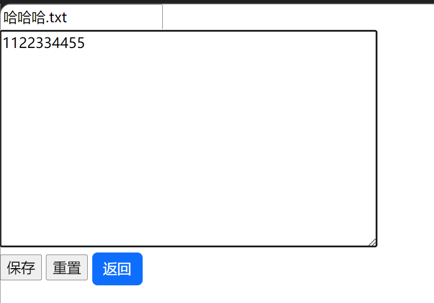
