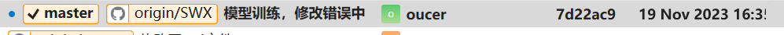

# 09组团队项目 - Alpha冲刺 - 1/3

## 一、基本情况

### 团队ID

09

### 组长博客

链接：[[Elecmark_OUC-软件工程-CSDN博客](https://blog.csdn.net/LanLinHui?spm=1011.2415.3001.5343)]

### 小组成员

- 普典衡
- 司宇萌
- 孙文秀
- 王诗梦
- 王菲

## 二、冲刺概况汇报

### 普典衡

- 过去两天完成的任务：

  - 使用Photoshop制作了网页的主界面视图UI效果示意图和LOGO
  - 按照设计计划制作了网站HTML页面
  - 展示GitHub当日代码/文档签入记录：
  - 
- 接下来的计划：

  - 继续美化前端，思考更多前端功能，配合后端
- 还剩下的任务：

  - 添加更多便捷功能，提升用户体验
- 遇到的困难：

  - 前端各种插件按钮的位置大小调整，排列方式和外观，页面缩放引起的组件排列等等的调试问题
- 收获和疑问：

  - 学会了fork的使用，加强了web前端的知识

### 司宇萌

- 过去两天完成的任务：

  - 了解学会使用fork，学习了解如何搭建web项目和配置，完成了部分前端任务。
  - 展示GitHub当日代码/文档签入记录：

  - 

- 接下来的计划：

  - 与后端结合，实现前端的图像显示和页面优化。

- 还剩下的任务：

  - 将前端与后端结合，对页面进一步美化。

- 遇到的困难：

  - 对项目的规划还不够了解，遇到一些技术问题需要加强合作。

- 收获和疑问：

  - 学会了fork的使用，学会用js设计网页。

### 孙文秀

- 过去两天完成的任务：

  - 学习了fork的使用，学习并尝试实现了CNN自动编码器的基本框架，训练模型中。
  - 展示GitHub当日代码/文档签入记录：

  - 

- 接下来的计划：

  - 继续修改错误，继续调试CNN编码器训练。

- 还剩下的任务：

  - 将CNN编码器训练完成，争取得到输出结果。

- 遇到的困难：

  - 错误很多，不熟悉用java编写CNN，训练过程中的错误还没有得到修改，正在学习和修改中。

- 收获和疑问：

  - 学会使用fork，了解了nd4j库的使用及CNN基本结构。

### 王诗梦

- 过去两天完成的任务：

  - 学会fork的使用，学习了解如何搭建web项目的系统框架，制定初步的计划
  - 展示GitHub当日代码/文档签入记录：

  - 

- 接下来的计划：

  - 搭建好整体系统框架

- 还剩下的任务：

  - 搭建后台接受前端传来的图片，调用训练好的神经网络模型，返回处理好的图片给前端

- 遇到的困难：

  - 对项目的规划还不够清晰，对大部分运用到的知识不够熟练

- 收获和疑问：

  - 学会了fork的使用以及多人协同完成一个项目

### 王菲

- 过去两天完成的任务：

  - 学习了fork的使用，在git上创建了仓库
  - 展示GitHub当日代码/文档签入记录：

  - 

- 接下来的计划：

  - 系统架构搭建，搭建好整体的Web项目的系统框架，使用Django框架来实现开发。

- 还剩下的任务：

  - 搭建后台，接受前端传来的图片url，同时以python脚本的形式调用训练好的神经网络模型，再将处理好的图片返回给前端。

- 遇到的困难：

  - 没有学习过python，不太了解后端的工作，不了解Django如何调用训练好的模型

- 收获和疑问：

  - 学习了基本的git和python知识，对于后续调用训练好的模型还比较困惑

## 三、冲刺成果展示

### 最新成果展示

- Logo
- 主界面UI初版示意图
- 网站主页面
- 点击图片放大显示功能

### 站立会议合照

- 

### 会议时间、地点、内容记录

- **时间**：2023.11.19 14:00
- **地点**：图书馆研讨室303
- **内容**：
  
  - #### 团队进展
  
    - **前端开发**：
      - 完成了网页主界面视图UI和LOGO的制作，以及网站HTML页面的初步设计。
      - 已实现部分前端功能，并对前端进行初步美化。
    - **后端开发**：
      - 着手搭建Web项目的系统框架。
      - 初步学习并尝试实现CNN自动编码器的基础框架，模型训练正在进行中。
    - **项目管理和协调**：
      - 团队成员均已学习使用fork进行协作。
      - 项目的GitHub代码和文档签入记录展示了目前的进展。
  
    #### 未来计划
  
    - **前端开发**：
      - 继续改善前端设计和用户体验，增加更多便捷功能。
      - 将前端与后端结合，优化图像显示和页面设计。
    - **后端开发**：
      - 继续完善CNN编码器的训练，解决遇到的技术难题。
      - 完成系统框架的搭建，特别是后台处理模块，以实现前端图像的接收和处理。
    - **团队协作**：
      - 加强团队成员间的沟通和协作，尤其是在项目规划和技术问题解决方面。
      - 持续学习和掌握新知识和工具。
  
    #### 当前挑战
  
    - 团队成员对项目规划和所用技术不够熟悉，需要加强学习和协作。
    - 在CNN编码器的训练和后端开发中遇到了一些技术难题，正在寻求解决方案。