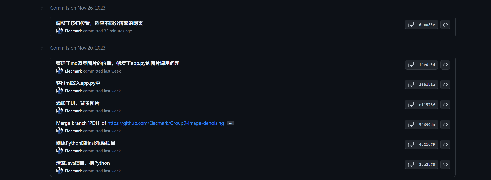
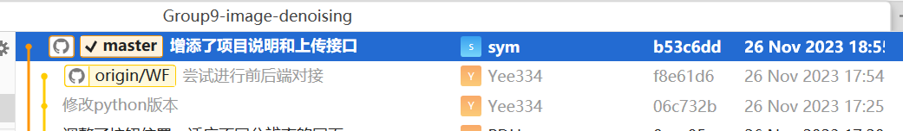
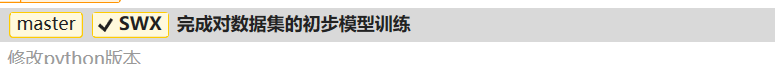
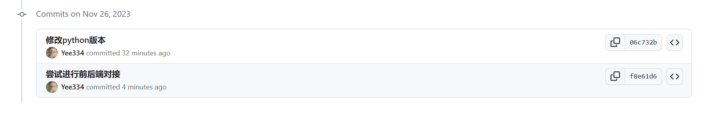
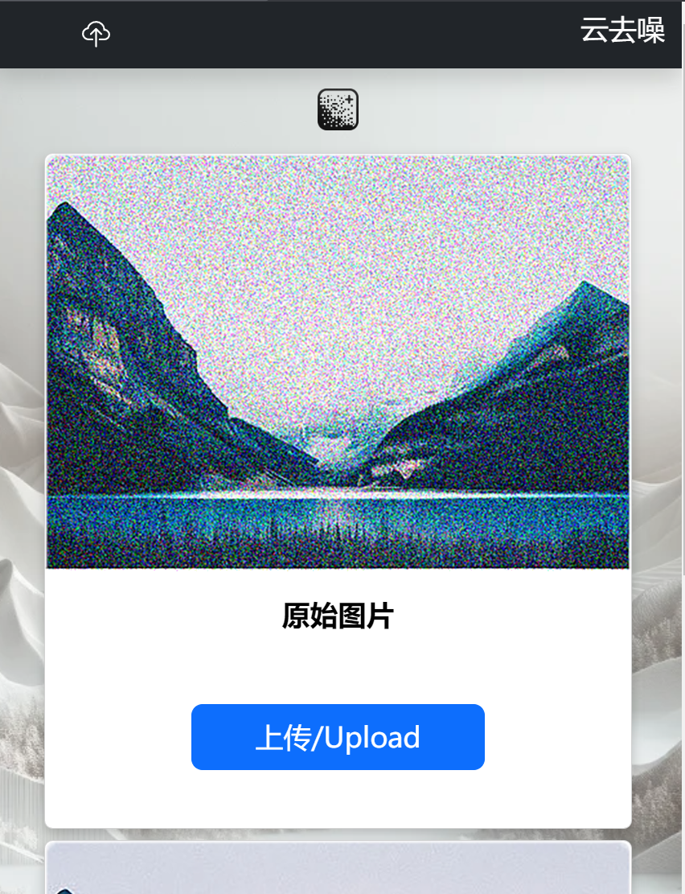
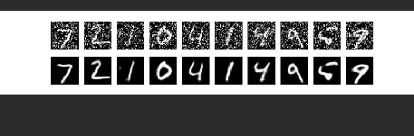

# 09组团队项目 - Alpha冲刺 - 2/3

## 一、基本情况

### 团队ID

09

### 组长博客

链接：[[Elecmark_OUC-软件工程-CSDN博客](https://blog.csdn.net/LanLinHui?spm=1011.2415.3001.5343)]

### 小组成员

- 普典衡
- 司宇萌
- 孙文秀
- 王诗梦
- 王菲

## 二、冲刺概况汇报

### 普典衡

- 过去完成的任务：

  - 优化了前端显示，修复了不同屏幕分辨率下的显示错误bug
  
  - 将Java项目转为Python的flask项目
  
    
  
- 接下来的计划：

  - 配合后端接口，加入类似锁的机制防止卡死
  
- 还剩下的任务：

  - 添加更多便捷功能，提升用户体验，继续美化前端，思考更多前端功能
  
- 遇到的困难：

  - 页面缩放引起的组件遮挡消失，滑动条显示问题
  
- 收获和疑问：

  - 对前端的理解更深入，学会了pycharm转换更改项目所用的Python版本，对前后端对接还不太清楚

### 司宇萌

- 过去完成的任务：

  - 学习了python，安装了pycharm，并配置了python。更新了前端网页，学习前后端交互相关知识。
  - 

- 接下来的计划：

  - 继续优化页面设计，配合后端交互。

- 还剩下的任务：

  - 提升用户体验，继续美化页面，实现图片的流转。

- 遇到的困难：

  - pycharm打开不了网页，python安装失败。

- 收获和疑问：

  - 学习了python，前后端等知识。疑问是现在的训练模型需要的是一个数据集，如何将单个图片放到文件夹中。

### 孙文秀

- 过去完成的任务：

  - 决定使用pycharm完成项目，配置pycharm环境，完成加噪并去噪的CNN自动编码器。
  - 

- 接下来的计划：

  - 尝试去掉加噪部分，对一张本身带噪声的图片进行去噪。

- 还剩下的任务：

  - 完成模型训练并接入后端

- 遇到的困难：

  - python版本过新，导致TensorFlow模块不能安装，只能重新安装3.9版本。数据集下载失败，只能通过本地下载，再用路径读取。

- 收获和疑问：

  - 对CNN模型有了更多认识，学会了pycharm的使用。

### 王诗梦

- 过去完成的任务：

  - 配置pycharm环境，了解接口文档的写法，学习前后端交互知识
  - 

- 接下来的计划：

  - 将模型接入后端，写接口文档，完成前后端交互

- 还剩下的任务：

  - 前后端交互，与模型的数据对接

- 遇到的困难：

  - 在pycharm中因为版本问题下载框架失败，已解决

- 收获和疑问：

  - 大概了解了接口文档的写法,简单学习前后端交互 ，对图片的传输和对接过程还是不太清楚

### 王菲

- 过去完成的任务：

  - 尝试用pycharm将模型接入后端，并用apifox写接口文档
  - 

- 接下来的计划：

  - 将模型接入后端并继续完成接口文档

- 还剩下的任务：

  - 与前端对接

- 遇到的困难：

  - python版本问题，将模型接入后端时遇到了一些问题

- 收获和疑问：

  - 学习了简单的后端知识

## 三、冲刺成果展示

### 最新成果展示

- 正常网页分辨率显示

  

- 窄分辨率显示

  

- 数据集的模型训练

  

### 站立会议合照

- 

### 会议时间、地点、内容记录

- **时间**：2023.11.26 16:00

- **地点**：图书馆研讨室304

- **内容**：

  #### 1. 项目进展概况

  - 讨论了团队成员在项目中的整体进展情况，包括前端显示优化、项目从Java转换到Python Flask的进展，以及前后端交互的学习和实现。
  - 着重强调了对不同屏幕分辨率的适配问题，确保网页在不同设备上均能正常显示。

  #### 2. 技术难点和解决方案

  - 分析了在项目开发中遇到的技术难题，如页面缩放导致的组件遮挡和滑动条显示问题，以及Python版本兼容性问题。
  - 讨论了可能的解决方案，包括技术选型调整、版本兼容性检查，以及增强团队成员之间的技术交流。

  #### 3. 后续计划和任务分配

  - 计划了接下来的工作，包括继续优化前端页面设计，加强前后端的数据交互，以及将机器学习模型更好地集成到后端。
  - 对剩余任务进行了详细的分配，确保每位团队成员都清楚自己的责任和接下来的工作重点。