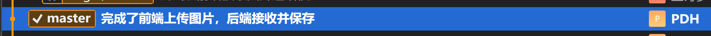
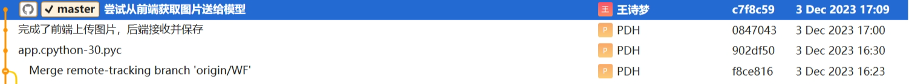
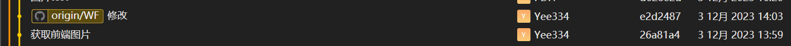
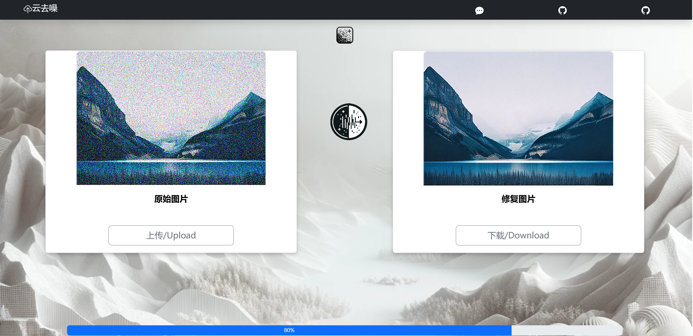
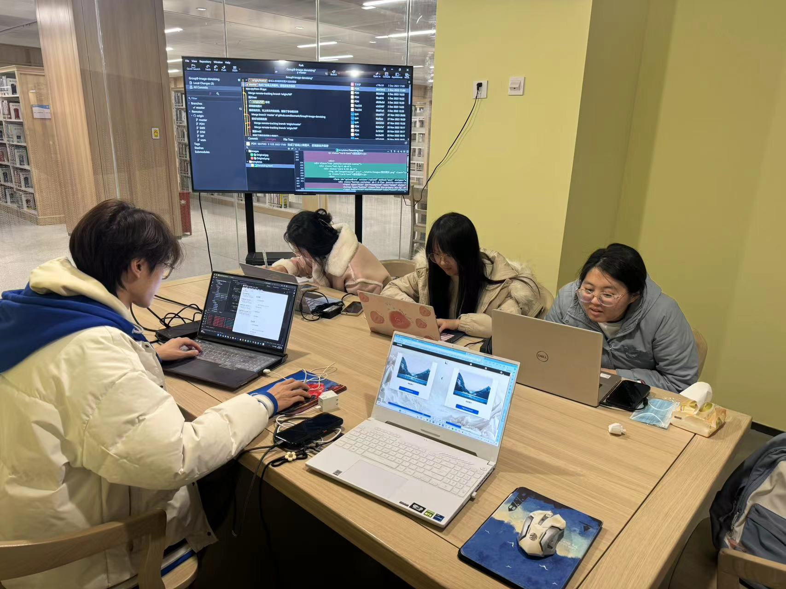

# 09组团队项目 - Alpha冲刺 - 3/3

## 一、基本情况

### 团队ID

09

### 组长博客

链接：[[Elecmark_OUC-软件工程-CSDN博客](https://blog.csdn.net/LanLinHui?spm=1011.2415.3001.5343)]

### 小组成员

- 普典衡
- 司宇萌
- 孙文秀
- 王诗梦
- 王菲

## 二、冲刺概况汇报

### 普典衡

- 过去完成的任务：

  - 成功连接前后端，前端上传按钮点击后可以选择图片上传，上传后在前端有显示，并且通过后端将上传图片存储在了images里
  
    
  
- 接下来的计划：

  - 进一步优化前端功能与界面，实现新增的转换按钮的功能（与后端对接）
  
- 遇到的困难：

  - 前后端连接错误，改正script中的方法后解决
  
- 收获和疑问：

  - 对JavaScript与HTML理解更深入，对前端布局理解

### 司宇萌

- 过去完成的任务：

  - 增加了一个开始去噪的按钮，配置了ui图像，调整页面，修改按钮的颜色。
  - 
- 接下来的计划：

  - 完成前后端的对接工作，将模型接入传送过程，实装相应的按钮和进度条的功能
- 遇到的困难：

  - 模型未接入
- 收获和疑问：

  - 学习前端，学习python语言，了解前后端交互

### 孙文秀

- 过去完成的任务：

  - 使用训练的模型对本地图片进行去噪，对模型多次修改以达到期望效果。
  
- 接下来的计划：

  - 继续修改模型，实现输出图片颜色与输入图片相同。

- 遇到的困难：

  - 刚开始的模型，输入输出图片颜色与原图像不一致，改过之后输入图片正确，但是输出图像不仅模糊，而且没有色彩，这个问题现在依旧没有解决。

- 收获和疑问：

  - 学习CNN自动编码器，学习了python语法。

### 王诗梦

- 过去完成的任务：

  - 尝试获取前端图片并将其传给模型进行训练，但只完成从前端获取图片存到本地文件夹
  - 
- 接下来的计划：

  - 完成前后端对接工作，将模型接入传送过程
- 遇到的困难：

  - 图片保存路径与预期不符，还无法连接到模型
- 收获和疑问：

  - 学习到了一些后端相关知识，学习了python语言，了解前后端交互

### 王菲

- 过去完成的任务：

  - 进行了前后端的部分对接，目前实现了从前端获取要修复的图片到本地
  - 
- 接下来的计划：

  - 继续完成前后端对接工作，实现将训练好的图片传回给前端
- 遇到的困难：

  - 前后端对接时出现问题，前端上传的图片无法保存到本地制定文件夹
- 收获和疑问：

  - 学习了相关的Python知识，了解前后端对接的基本工作

## 三、冲刺成果展示

### 最新成果展示

- 添加了转换按钮

  

### 站立会议合照

- 

### 会议时间、地点、内容记录

- **时间**：2023.12.3 16:00

- **地点**：图书馆研讨室303

- **内容**：

  #### 1. 项目进展概况

  团队在Alpha冲刺阶段取得了显著进展。关键成就包括：
  
  - **前后端连接**：成功实现了前后端的基本连接，使前端可以上传图片，后端可以接收并存储这些图片。
  - **界面优化**：团队成员对用户界面进行了改进，增加了去噪按钮，并优化了界面的整体布局和视觉效果。
  - **模型训练与应用**：对去噪模型进行了训练和调整，以便更好地处理上传的图片。
  
  #### 2. 技术难点和解决方案

  团队在项目实施过程中遇到了几个技术挑战：
  
  - **前后端对接问题**：解决了前后端连接时出现的错误，主要通过调整代码和脚本实现。
  - **模型集成问题**：正在努力将去噪模型完全集成到前后端流程中，以便实现自动处理上传的图片。
  - **图像处理问题**：在图像去噪的模型训练中遇到了输出图像颜色和清晰度的问题，团队正在通过调整模型参数和算法来解决这些问题。
  
  #### 3. 后续计划和任务分配
  
  为了继续推进项目，团队制定了以下计划和任务分配：
  
  - **前端功能优化**：继续提升用户界面，包括增加新的功能按钮和改进现有布局。
  - **模型优化与集成**：继续调整和改进去噪模型，确保模型能够有效集成到整个系统中。
  - **前后端进一步对接**：加强前后端的协同工作，确保系统的流畅运行，特别是在图像上传和处理方面。
  
  团队将继续密切协作，确保按时完成项目目标，同时解决任何新出现的技术挑战。