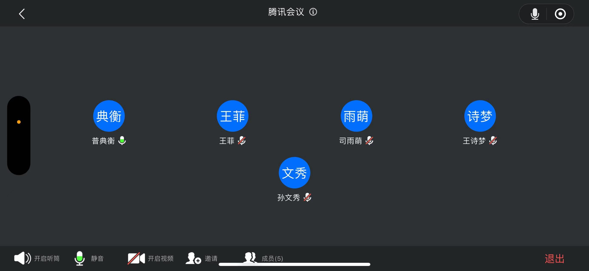

# 09组团队项目 - Beta冲刺 - 1/3

## 一、基本情况

### 团队ID

09

### 组长博客

链接：[[Elecmark_OUC-软件工程-CSDN博客](https://blog.csdn.net/LanLinHui?spm=1011.2415.3001.5343)]

### 小组成员

- 普典衡
- 司宇萌
- 孙文秀
- 王诗梦
- 王菲

## 二、冲刺概况汇报

### 普典衡

- 过去完成的任务：

  - 优化前端格式和排列表现
  
    
  
- 接下来的计划：

  - 进一步优化前端功能与界面，设计UI，实现新增的转换按钮的功能（与后端对接）
  
- 遇到的困难：

  - 组件扩展使整体屏幕分辨率改变出现bug，调整组件位置已经禁用横向滚动条之后解决
  
- 收获和疑问：

  - 对JavaScript与HTML理解更好，对前端布局理解加深

### 司宇萌

- 过去完成的任务：

  - 更改了顶部导航栏，重新安排了按钮的位置，修改了按钮的颜色。
  - 
- 接下来的计划：

  - 完成前后端的对接工作，将模型接入传送过程，实装相应的按钮和进度条的功能
- 遇到的困难：

  - 模型未接入，模型训练困难
- 收获和疑问：

  - 学习前端，学习python语言，了解前后端交互

### 孙文秀

- 过去完成的任务：

  - 修改模型，实现输入图片与输出图片颜色一致；增加训练轮数和卷积层数，以减请轻去噪后的模糊情况。
  - 
  
- 接下来的计划：

  - 继续修改模型，同时学习CNN编码器相关知识，寻求更好的模型用于图像去噪。

- 遇到的困难：

  - 电脑没有独显，模型训练很慢，而且图像模糊还没有得到解决。

- 收获和疑问：

  - 对CNN编码器的了解更多，认识了很多去噪算法。

### 王诗梦

- 过去完成的任务：

  - 协助模型训练的同学进行模型训练,修改部分细节使图片更适应模型
  - 
- 接下来的计划：

  - 完成模型训练及后端传输图片
- 遇到的困难：

  - 之前的模型训练效果不好，重新开始训练，模型和前端的交接遇到点问题
- 收获和疑问：

  - 了解了模型训练的一些知识

### 王菲

- 过去完成的任务：

  - 协助模型训练的同学进行模型训练
- 接下来的计划：

  - 完成模型训练及后端传输图片
- 遇到的困难：

  - 之前的模型训练效果不好，重新开始训练
- 收获和疑问：

  - 了解了模型训练的一些知识

## 三、冲刺成果展示

### 最新成果展示

- 增加及修改加了顶部菜单栏的组件

  

### 站立会议合照

- 

### 会议时间、地点、内容记录

- **时间**：2023.12.10 20:00

- **地点**：腾讯会议

- **内容**：

  ### 进展回顾

  1. **前端开发**:
     - 在前端方面取得了重要进展。包括对前端格式的优化、排列表现的改善、顶部导航栏的重新设计，以及按钮颜色的调整。
     - 计划进一步增强前端功能和界面设计，特别是实现新的转换按钮功能，并与后端紧密对接。
  2. **模型训练与后端开发**:
     - 模型训练上，实现了输入输出图片颜色一致性的改进，并通过增加训练轮数和卷积层数减轻了去噪后的模糊情况。
     - 后续计划着重于模型的进一步改进，特别是针对CNN编码器的深入学习和应用，以及模型和前端的有效整合。
  
  ### 遇到的挑战
  
  - 团队面临的主要挑战包括前端组件扩展导致的bug、模型训练的效率问题以及前后端的有效整合。
  
  ### 收获与展望
  
  - 成员们在JavaScript、HTML、Python语言及前后端交互方面有了更深入的理解和应用。
  - 对CNN编码器和去噪算法的认识更加深入，为未来的开发提供了坚实的基础。
  
  ### 总结
  
  ​	总体来看，每位成员都在其专长领域作出了积极贡献。虽然面临一些技术挑战，但团队成员通过有效合作，已经取得了显著的进展，并对未来的工作有了清晰的规划和方向。