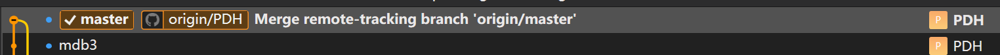
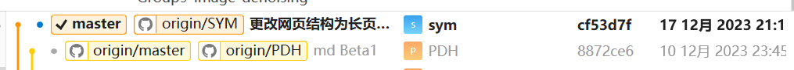
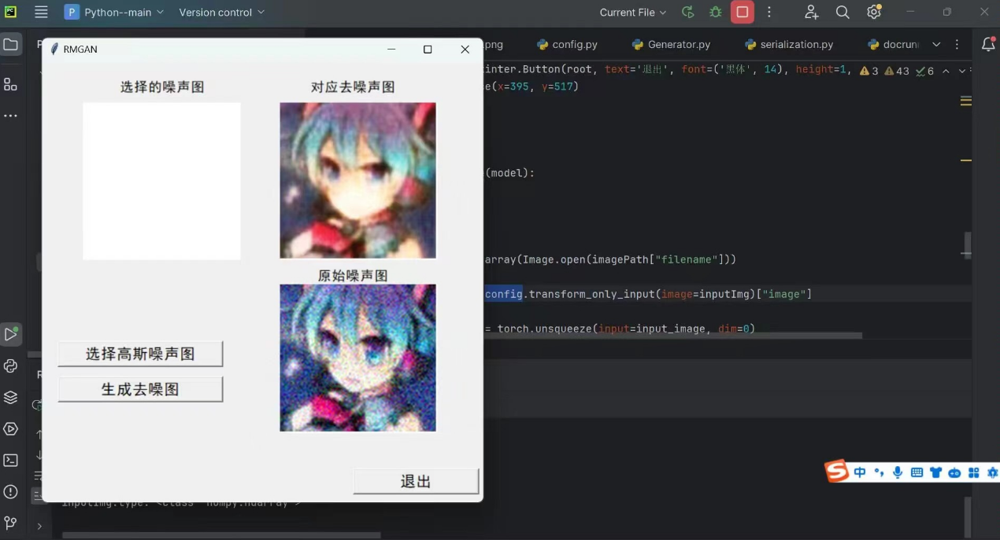
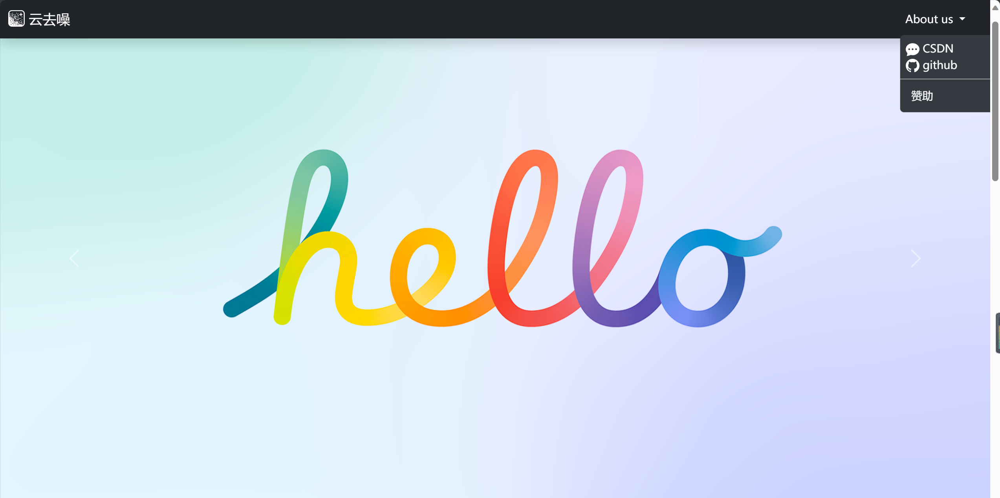
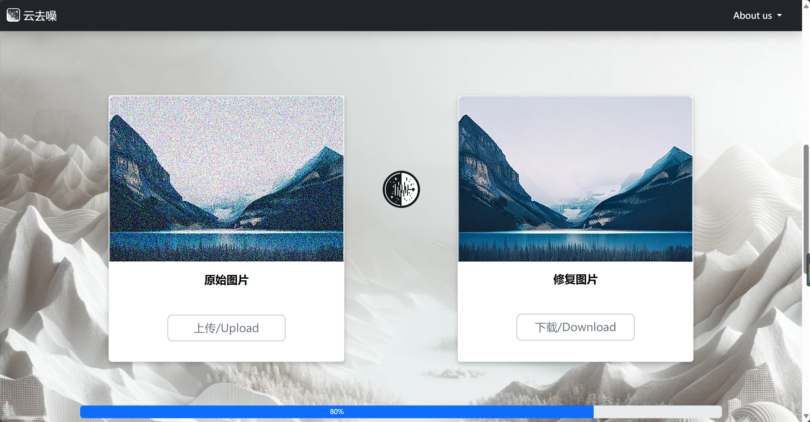
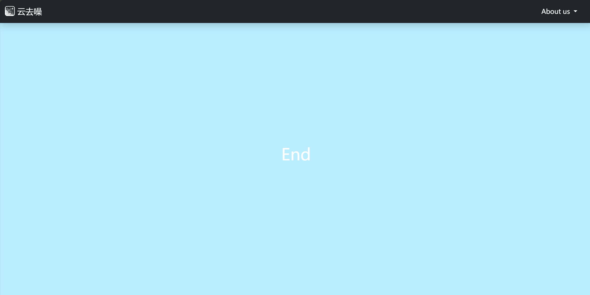
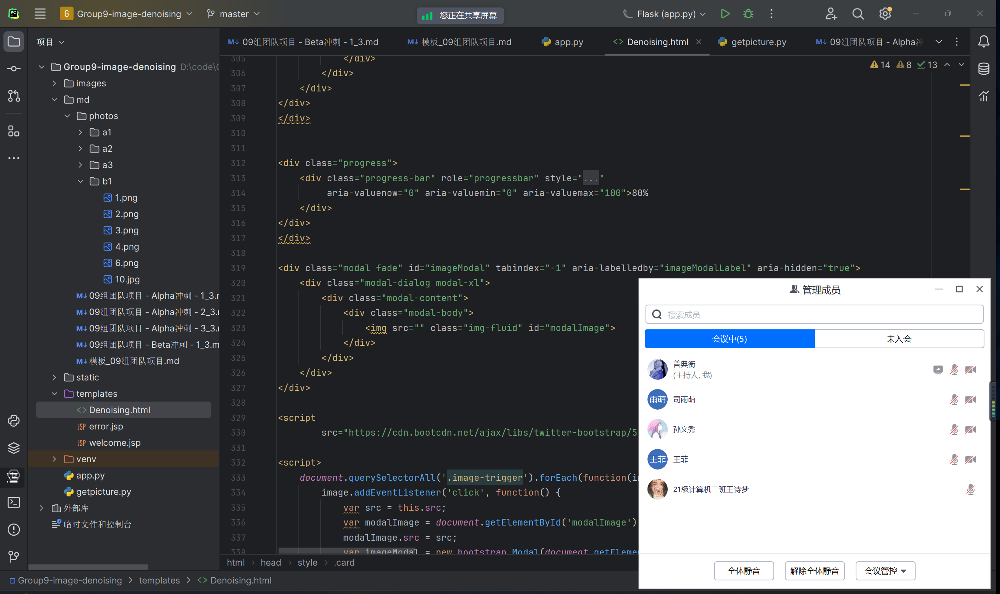

# 09组团队项目 - Beta冲刺 - 2/3

## 一、基本情况

### 团队ID

09

### 组长博客

链接：[[Elecmark_OUC-软件工程-CSDN博客](https://blog.csdn.net/LanLinHui?spm=1011.2415.3001.5343)]

### 小组成员

- 普典衡
- 司宇萌
- 孙文秀
- 王诗梦
- 王菲

## 二、冲刺概况汇报

### 普典衡

- 过去完成的任务：

  - 前端微调，使导航栏固定在屏幕，删除冗余按钮，使下拉菜单正常实现，进行了UI和背景调整的美化工作
  
    
  
- 接下来的计划：

  - 继续优化滚动式前端，添加轮转图片，设计网页介绍UI和按钮UI等等
  
- 遇到的困难：

  - 动画效果还未实现
  
- 收获和疑问：

  - 学习了前端动效以及美化，阅读了相关案例代码

### 司宇萌

- 过去完成的任务：

  - 更改页面结构为滑动式长页面，增添了模态框，增添了轮播图片动效
  - 
- 接下来的计划：

  - 修改UI里的一些新的bug，完成前后端的对接工作，丰富美化页面
- 遇到的困难：

  - 模型未接入，模型训练困难，轮播图总是自己放大，动画效果加载失败
- 收获和疑问：

  - 学习了前端动效美化知识，阅读了相关代码

### 孙文秀

- 过去完成的任务：

  - 参考老师的代码，实现了CBDnet模型进行去噪，模型训练完成。
  - 
  
- 接下来的计划：

  - 协助负责后端的同学进行模型的调用。

- 遇到的困难：

  - 采用CNN模型，总是会出现图片部位丢失的错误，所以改用CBDnet模型。由于模型是用GPU运行的，我只能在同学的电脑上运行

- 收获和疑问：

  - 学习到了CBDnet的有关知识。

### 王诗梦

- 过去完成的任务：

  - 辅助训练备选模型，挑选出效果最好的模型，解决图片上传报错的问题
  - 
- 接下来的计划：

  - 进一步实现图片的传输，完成前后端对接工作
- 遇到的困难：

  - 模型训练的效果图存在各种各样的问题，图片的传输依旧有点混乱
- 收获和疑问：

  - 了解到不同的路径写法，学习到不同路径对图片传输的影响

### 王菲

- 过去完成的任务：

  - 辅助训练模型，编写后端接口
  - 
- 接下来的计划：

  - 完成后端任务，实现图片的传输与保存
- 遇到的困难：

  - 训练的模型去噪效果不是很好，图片太过模糊，并且对图片格式要求很严格
- 收获和疑问：

  - 学习了python的一些基础知识

## 三、冲刺成果展示

### 最新成果展示

- 网站前端改为滚动式，美化了界面，结构重新设计

  
  
  
  
  

### 站立会议合照

- 

### 会议时间、地点、内容记录

- **时间**：2023.12.17 19:00

- **地点**：腾讯会议

- **内容**：

  #### 1. 前端开发进展

  - **界面重设计**：网站前端已改为滚动式，为用户提供了更流畅的浏览体验。
  - **UI/UX改善**：对用户界面和体验进行了显著的美化和优化，使网站更加吸引用户。
  - **动效和微调**：实现了一些基本的动画效果，对导航栏、下拉菜单等元素进行了微调，以提高页面的整体美观性和用户体验。
  
  #### 2. 后端开发与模型训练
  
  - **模型选择与训练**：经过对比，选择了CBDnet模型进行去噪处理，模型训练有初步成果。
  - **后端接口与集成**：开发了后端接口，正在努力实现前后端的顺畅对接，以及图片的有效传输与保存。
  
  #### 3. 遇到的挑战
  
  - **模型效果与优化**：目前模型去噪效果存在一些问题，如图片模糊、格式要求严格等，团队正在积极寻找解决方案。
  - **动画效果实现**：一些复杂的动画效果实现上存在困难，团队成员正在学习相关技术以改善这一点。
  
  #### 4. 收获与展望
  
  - **技术提升**：通过本项目，团队成员在前端设计、后端开发和模型训练方面都有了显著的成长。
  - **团队协作**：加强了团队间的沟通和协作，通过共同解决问题增强了团队凝聚力。
  
  #### 5. 总结
  
  - 本次Beta冲刺阶段，团队成员共同努力，取得了显著的进步。尽管面临诸多挑战，但团队通过有效的沟通和协作，不断优化项目，朝着最终目标稳步前进。未来，团队将继续致力于解决剩余的技术难题，并期待在项目最终阶段呈现出更加完善的成果。